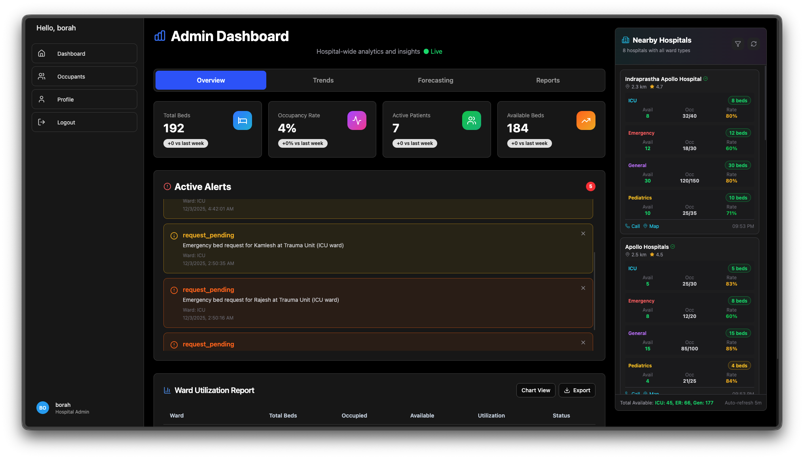
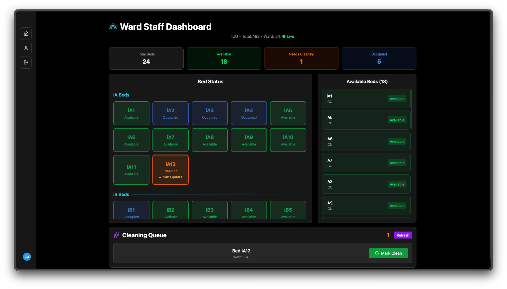

# Bed Manager — Team 25

> Real-time hospital bed management with predictive analytics and role-based dashboards.




---

## Overview

**Bed Manager** is a full-stack hospital bed management platform built to streamline bed allocation across multiple wards. It provides **real-time occupancy tracking**, **predictive ML analytics**, and **tailored dashboards** for every role: from front-line ward staff to hospital administrators.

The system manages **multiple beds** across customizable wards:

example:

| Ward      | Beds | Profile                                     |
| --------- | ---- | ------------------------------------------- |
| ICU       | 24   | Critical care, highest turnover sensitivity |
| General   | 84   | Standard inpatient care                     |
| Emergency | 84   | High-throughput admissions and transfers    |

---

## Features

- **Real-Time Bed Tracking**: Live occupancy status via Socket.IO; instant updates across all connected clients.
- **Predictive Analytics**: ML-powered forecasts for discharge timing, cleaning duration, and bed availability to reduce idle time.
- **Multi-Role Dashboards**: Custom views for:
  - **Admin**: System-wide oversight, user management, reporting.
  - **Manager**: Ward-level KPIs, capacity planning, audit logs.
  - **Ward Staff**: Bed assignment, patient check-in/out, cleaning status.
  - **ER Staff**: Fast admission triage, emergency bed search.
- **Smart Allocation**: Suggests optimal beds based on patient priority, ward capacity, and predicted availability.
- **Responsive UI**: Modern React 19 interface built with Vite for fast development and production builds.

---

## Tech Stack

| Layer           | Technology                   | Purpose                                          |
| --------------- | ---------------------------- | ------------------------------------------------ |
| **Frontend**    | React 19 + Vite              | Interactive SPA, fast HMR, optimized builds      |
| **Backend API** | Node.js + Express            | REST API, business logic, authentication         |
| **ML Service**  | Python + FastAPI             | Model inference endpoints, analytics API         |
| **Database**    | MongoDB                      | Document store for beds, patients, users, logs   |
| **Real-Time**   | Socket.IO                    | Bidirectional event streaming for live updates   |
| **ML Models**   | Scikit-learn (Random Forest) | Discharge, cleaning, and availability prediction |

[](https://react.dev)
[](https://vitejs.dev)
[](https://nodejs.org)
[](https://expressjs.com)
[](https://fastapi.tiangolo.com)
[](https://www.mongodb.com)
[](https://socket.io)

---

## Project Structure

```
bedmanager-team25/
├── backend/          # Node.js/Express API (port 5001)
│   ├── server.js     # Application entry point
│   ├── routes/       # API route definitions
│   ├── models/       # Mongoose schemas
│   └── controllers/  # Request handlers
├── demo/             # Assets for docs
├── docs/             # Project Documentation
├── frontend/         # React 19 + Vite SPA (port 5173)
│   ├── src/
│   ├── index.html
│   └── vite.config.js
├── ml-service/       # Python/FastAPI ML microservice (port 8000)
│   ├── main.py       # Service entry point
│   └── models/       # Trained Random Forest models
├── HOW_TO_RUN.md     # Detailed setup & run instructions
└── README.md         # This file
```

---

## Prerequisites

- **Node.js** >= 20.x
- **npm** >= 10.x
- **Python** >= 3.10
- **MongoDB** >= 6.0 (local or Atlas)
- _(Optional)_ **pip** / **venv** for Python environment management

---

## Setup & Installation

For **step-by-step installation**, environment setup, and troubleshooting, see [`HOW_TO_RUN.md`](./docs/HOW_TO_RUN.md) at the repository root.

### Quick Start

1. **Clone the repository**

   ```bash
   git clone <repo-url>
   cd bedmanager-team25
   ```

2. **Backend**

   ```bash
   cd backend
   npm install
   npm start        # runs on http://localhost:5001
   ```

3. **Frontend**

   ```bash
   cd frontend
   npm install
   npm run dev      # runs on http://localhost:5173
   ```

4. **ML Service**
   ```bash
   cd ml-service
   python -m venv venv
   source venv/bin/activate  # Windows: venv\Scripts\activate
   pip install -r requirements.txt
   uvicorn main:app --reload --port 8000
   ```

> Ensure MongoDB is running and environment variables are configured before starting services.

---

## Usage & Entry Points

| Service     | Entry Point                | Port   | Command                                                        |
| ----------- | -------------------------- | ------ | -------------------------------------------------------------- |
| Backend API | `backend/server.js`        | `5001` | `npm start` (within `backend/`)                                |
| Frontend    | `frontend/vite dev server` | `5173` | `npm run dev` (within `frontend/`)                             |
| ML Service  | `ml-service/main.py`       | `8000` | `uvicorn main:app --reload --port 8000` (within `ml-service/`) |

1. Start **MongoDB**.
2. Start **Backend** (`backend/server.js`).
3. Start **ML Service** (`ml-service/main.py`).
4. Start **Frontend** (`frontend/vite dev server`).
5. Open `http://localhost:5173` and log in with your role credentials.

---

## Environment Variables

Each service uses its own environment configuration. Create `.env` files in `backend/` and `ml-service/` as needed.

| Variable       | Service    | Description                                     |
| -------------- | ---------- | ----------------------------------------------- |
| `MONGO_URI`    | Backend    | MongoDB connection string                       |
| `PORT`         | Backend    | API server port (default: `5001`)               |
| `JWT_SECRET`   | Backend    | Secret for signing JSON Web Tokens              |
| `ML_API_URL`   | Backend    | Base URL of the ML FastAPI service              |
| `FRONTEND_URL` | Backend    | CORS origin for the React dev server            |
| `PYTHON_ENV`   | ML Service | `development` or `production`                   |
| `MODEL_PATH`   | ML Service | Directory containing trained `.pkl` model files |

> See `HOW_TO_RUN.md` for a complete `.env` template.

---

## ML Models Summary

The ML microservice exposes three **Random Forest** regression / classification models:

| Model                           | Output                                                 | Business Impact                    |
| ------------------------------- | ------------------------------------------------------ | ---------------------------------- |
| **Discharge Time Predictor**    | Estimated time until a patient is discharged           | Improves bed turnover forecasting  |
| **Cleaning Duration Predictor** | Predicted minutes to clean and sanitize a bed          | Schedules housekeeping efficiently |
| **Bed Availability Predictor**  | Likelihood a specific bed will free up within a window | Enables proactive allocation       |

Models are trained on historical ward data and served via FastAPI endpoints for low-latency inference.

---

## Team

**Team 25** — Hospital Bed Manager

Developed as a collaborative full-stack engineering project featuring:

- Real-time systems design
- Machine learning operations (MLOps) integration
- Role-based access control (RBAC)
- Responsive, accessibility-aware frontend engineering

---
